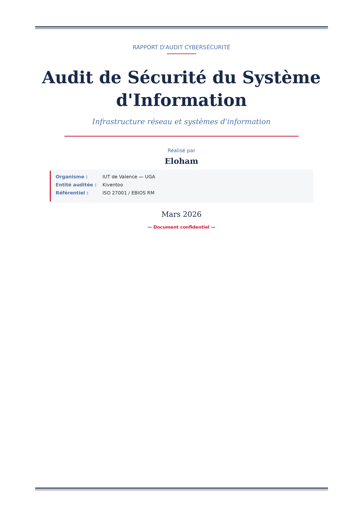
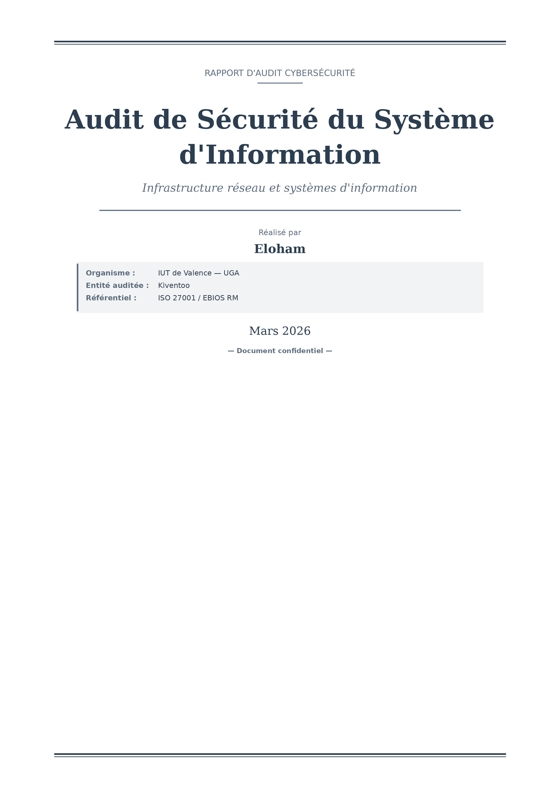
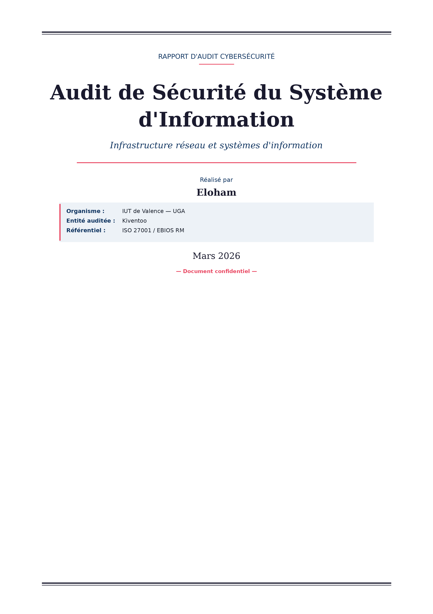
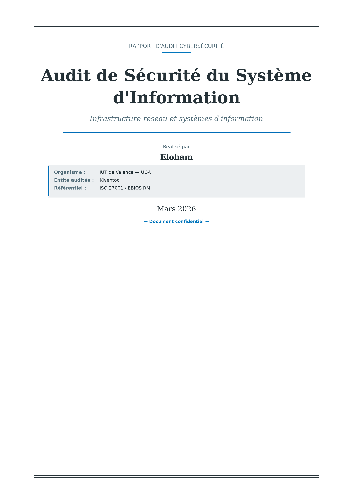
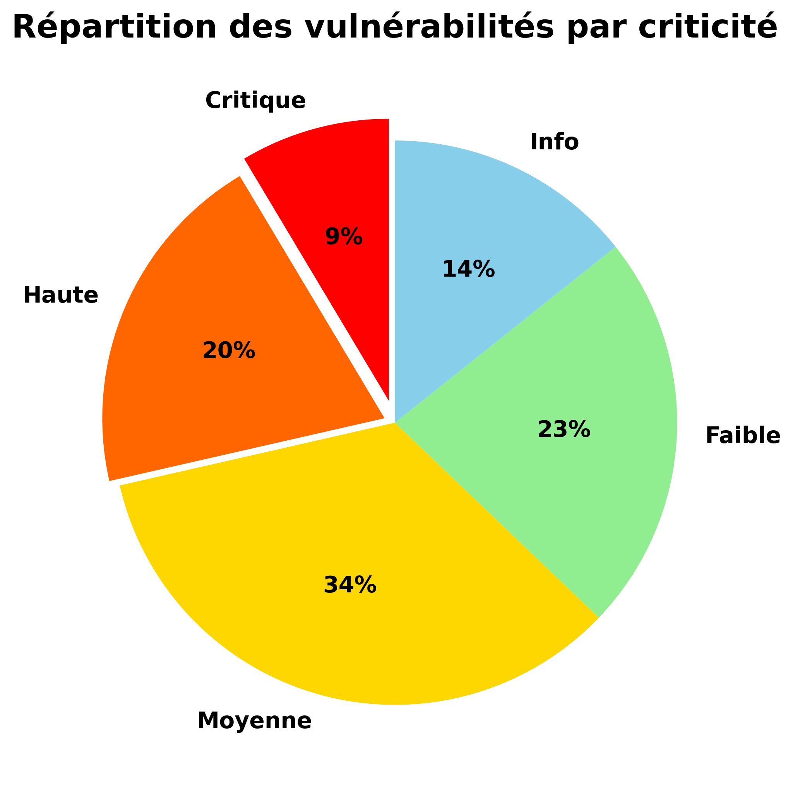
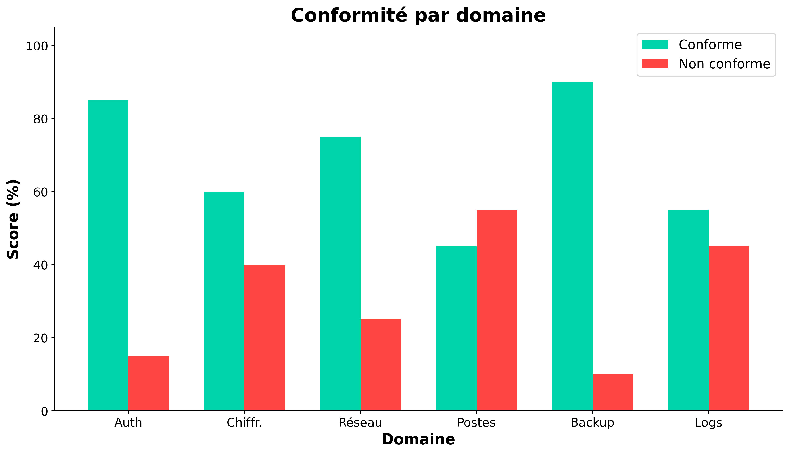
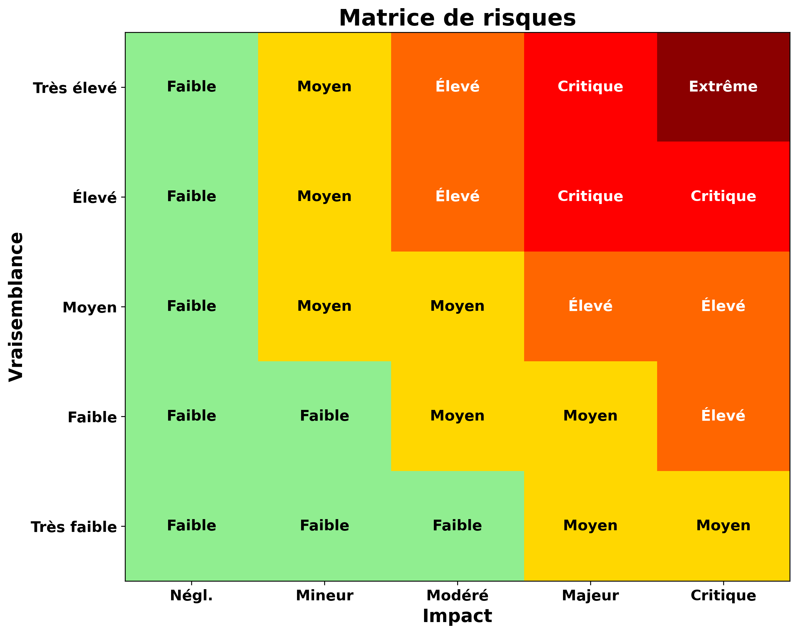

<p align="center">
  
</p>

<h1 align="center">🔒 Pro-DOCX</h1>

<p align="center">
  <strong>Skill Claude premium pour générer des documents Word professionnels de qualité ingénieur.</strong>
</p>

<p align="center">
  
  
  
  
</p>

---

## ✨ Fonctionnalités

- **Page de garde premium** — Générée en image haute résolution (300 DPI) avec design pro : bloc foncé, éléments géométriques, typographie soignée
- **4 chartes graphiques** — IUT Valence/UGA, MegaO Informatique, Professionnel Neutre, Cybersécurité + support personnalisé
- **4 types de documents** — Rapport d'audit cybersécurité, Mémoire/thèse, TD/TP, Rapport technique
- **Structure automatique** — Table des matières, table des figures, en-têtes/pieds de page, numérotation
- **Illustrations auto** — Graphiques matplotlib avec polices lisibles, diagrammes, matrices de risques
- **Légendes numérotées** — "Figure N — Description" et "Tableau N — Description" systématiques
- **Vérifications post-génération** — Pages blanches, chevauchement texte/images, cohérence des numérotations
- **Workflow guidé** — Le skill pose les bonnes questions avant de générer

---

## 🎨 Chartes graphiques

<table>
  <tr>
    <td align="center"><br/><b>Classique</b></td>
    <td align="center"><br/><b>Professionnel Neutre</b></td>
    <td align="center"><br/><b>Cybersécurité</b></td>
    <td align="center"><br/><b>Rapport Technique</b></td>
  </tr>
</table>

---

## 📊 Exemples d'illustrations générées

Les graphiques sont générés avec matplotlib en haute résolution, avec des polices suffisamment grandes pour rester lisibles une fois insérés dans le document.

<table>
  <tr>
    <td align="center"><br/><em>Répartition des vulnérabilités</em></td>
    <td align="center"><br/><em>Conformité par domaine</em></td>
    <td align="center"><br/><em>Matrice de risques EBIOS</em></td>
  </tr>
</table>

---

## 📦 Installation

1. Télécharger le fichier `pro-docx-skill.skill`
2. Ouvrir Claude → Paramètres → Skills
3. Glisser-déposer le fichier `.skill`

Le skill se déclenche automatiquement quand tu demandes un document Word pro, un rapport, un mémoire, un audit, un TD formaté, etc.

---

## 🚀 Utilisation

Le skill suit un **workflow en 3 phases** :

### Phase 1 — Collecte d'informations
Le skill te pose des questions sur :
- Le **type de document** (audit, mémoire, TD, rapport)
- La **charte graphique** souhaitée
- Les **infos de page de garde** (titre, auteur, formation, tuteurs...)
- Le **contexte** (objectif, destinataire, niveau de détail)

### Phase 2 — Génération
Le skill génère automatiquement :
- Page de garde premium en image pleine page
- Structure complète avec TOC, figures, bibliographie
- Graphiques et illustrations
- Tableaux pro avec headers colorés et lignes alternées

### Phase 3 — Vérification
Après génération, le script `verify-doc.py` vérifie en 7 étapes :
1. ✅ Validité du fichier DOCX
2. ✅ Structure XML
3. ✅ Pas de pages blanches
4. ✅ Espacement des images (anti-chevauchement)
5. ✅ Légendes présentes
6. ✅ Intro + Conclusion + Bibliographie
7. ✅ Numérotation séquentielle

---

## 📁 Structure du skill

```
pro-docx-skill/
├── SKILL.md                          # Instructions principales du skill
├── references/
│   ├── chartes.md                    # Définitions des 4 palettes de couleurs
│   ├── cover-page.md                 # Template de page de garde
│   └── doc-types.md                  # Structures par type de document
├── scripts/
│   ├── generate_cover.py             # Générateur de page de garde premium (Pillow)
│   ├── generate-doc.js               # Template de génération docx-js
│   ├── fix-borders.py                # Correction auto du bug de bordures OOXML
│   └── verify-doc.py                 # Vérification post-génération (7 checks)
└── assets/                           # Logos et ressources graphiques
```

---

## 🔧 Dépendances

Le skill utilise les outils disponibles dans l'environnement Claude :
- **Node.js** + `docx` (npm) — Génération des documents Word
- **Python 3** + `Pillow` + `matplotlib` — Pages de garde et graphiques
- **LibreOffice** (headless) — Conversion PDF pour vérification
- **Pandoc** — Extraction de texte

---

## 📋 Types de documents supportés

| Type | Structure | Illustrations typiques |
|------|-----------|----------------------|
| **Audit cybersécurité** | Cartographie SI → Vulnérabilités → Risques → Recommandations | Pie chart CVE, matrice EBIOS, tableaux CVSS |
| **Mémoire / Thèse** | État de l'art → Analyse → Réalisation → Bilan | Gantt, architecture, métriques |
| **TD / Compte-rendu TP** | Exercices avec énoncé → Démarche → Résultats | Captures terminal, schémas réseau |
| **Rapport technique** | Présentation → Analyse → Tests → Recommandations | Architecture, benchmarks, configs |

---

## 🤝 Contribuer

Ce skill a été créé avec Claude (Opus) dans une démarche de co-construction. Les contributions sont les bienvenues :

- 🐛 Signaler un bug → [Issues](../../issues)
- 💡 Proposer une amélioration → [Issues](../../issues)
- 🎨 Ajouter une charte graphique → PR sur `references/chartes.md`

---

## 📄 Licence

MIT — Utilisation libre, même en contexte professionnel et académique.

---

<p align="center">
  <sub>Fait avec ❤️ par <a href="https://github.com/caroneloham">Eloham</a> & Claude</sub>
</p>
